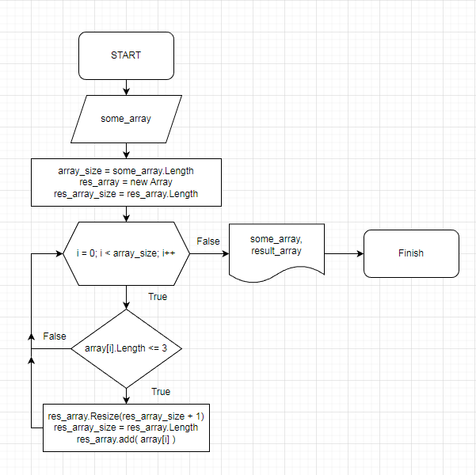

# Итоговая проверочная работа.

`Задача: Написать программу, которая из имеющегося массива строк формирует массив из строк, длина которых меньше либо равна 3 символа.`

`Первоначальный массив можно ввести с клавиатуры, либо задать на старте выполнения алгоритма. При решении не рекомендуется пользоваться коллекциями, лучше обойтись исключительно массивами.`
 

## Примеры:

`["hello", "2", "world", ":-)"] -> ["2", ":-)"]`

`["1234", "1567", "-2", "computer science"] -> ["-2"]`

`["Russia", "Denmark", "Kazan"] -> []`

 

## Для выполнения необходимо:
1.	Создать репозиторий на GitHub

2.	Нарисовать блок-схему алгоритма (можно обойтись блок-схемой основной содержательной части, если вы выделяете ее в отдельный метод)

3.	Снабдить репозиторий оформленным текстовым описанием решения (файл README.md)

4.	Написать программу, решающую поставленную задачу

5.	Использовать контроль версий в работе над этим небольшим проектом (не должно быть так что все залито одним коммитом, как минимум этапы 2, 3 и 4 должны быть расположены в разных коммитах)

 

# Этапы выполнения работы

## I. Подготовка
1. Создание шаблона консольного С# приложения
    - Создание шаблона: dotnet new console
2. Создание и подключение репозитория, Initial commit
    - Добавление файла .gitignore для С#
    - git init
    - git add .
    - git commit -m "Initial commit"
    - git remote add origin https://github.com/BloodRaven707/Guarter_1.git
    - git branch -M main
3. Создание и редактирование README.md
    - Создание файла README.md
    - Описание проделанных операций
4. Загрузка файлов в GitHub
    - Создание файла README.md
    - Описание проделанных операций
    - git push -u origin main
    
## II. Подготовка блок-схемы для версии 1.0
1. Разработка блок-схемы
    - https://app.diagrams.net/
2. Добавить блок-схему
    - ./source/Module_1_final_v1.drawio
     
    
     
3. Локальный комит
    - Описание проделанных операций
    - git add .
    - git commit -m "Add source"
4. Загрузка файлов проекта в GitHub
    - git push